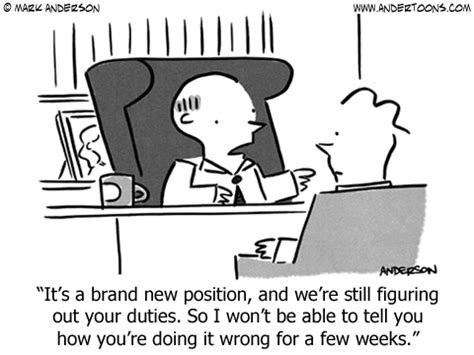

Awkward or just plain bad onboarding experiences are common. Maybe a login didn’t work or the IT person was on vacation so the workstation was incomplete. New employees are inundated with loads of information and paperwork. There might be meeting overload or a total lack of attention. 

Guidance for onboarding ranges from software to checklists, and tips on how to make the process smooth to reduce early turnover. These are helpful but don’t always solve crucial onboarding problems. 

This 3-step plan involves 3 documents and coordinating document reviews. It can apply to any industry and any type of position. 

## Document Review #1: Job Description Document

Job descriptions are undervalued. Before the internet, job seekers and employers had to use newspaper ads. Now with an unlimited canvas to present the job correctly and find the right candidate, they’re often treated as a throwaway task. Or lost within the framework of career pages, recruiting, services like Glassdoor, and over the top descriptions involving “badass” and “ninja.”

This result of this? Job descriptions don’t get read. 

Aside from a skim during the application process and a quick internal review when new positions are created, they’re treated as a cog in the wheel. In other words, we place far more importance on writing job descriptions than reading them. Here’s how to change that. 

**Create a job description style guide** - Details will vary by department, but information like company values, remote vs. co-located expectations, and company-wide software tools should be included. This will make the next steps more effective. 

**Conduct job description document review** - Have the new employee, their manager, and team members sit down together to read, review and critique the job description as necessary. 

This isn’t a printed version of the online job posting, but a long-form document with proprietary information, catalog of software tools/logins, cross-team collaboration details, and specific expectations. With large teams, choose a strategic grouping for the review, a mix of new and tenured employees will provide useful insight and ask time-saving questions. This job description document goes through rounds of improvement cycles as new and transferred employees come aboard. 

**Reach consensus** - By the end of the review, everyone has taken the time to read, review and update the new employee’s job description. Additionally, they’ve socialized in a low-pressure, ask-anything environment. The process is a culture play as much as it is a strategic onboarding method. 

This strategy addresses another management challenge, performance reviews. Job descriptions are an asset for both sides of the performance review. It provides clarity on what should be discussed, facilitates accountability and provides another opportunity to update and maintain the document. 

## Document Review #2: Launch Plan

The next document review is a traditional idea, but the information usually gets lost in a barrage of emails and one-way conversational meetings - the launch plan. 

Managers should create a templated document with the necessary personalization. This document review group should be smaller, managers might prefer a one-on-one setting or with another manager or team lead. The launch plan review should come after routine information has been shared. These documents involve goals, expectations, career growth steps and milestones, how to leverage personal and professional skill sets, expected challenges, etc. Attach these to 30, 60, 90-day timelines. Determine the first task, project and follow-up dates during this review. 

Launch plan documents provide employees context on what they should be doing and focusing on, it also creates an area of proficiency for managers who can focus on improving their launch plans year over year. This won’t be possible if the launch plan is stowed away and never read again. Plan to review this document along with the job description during performance reviews or progress updates. 

## Document Review #3: Employee Summary

The final onboarding document review is the most important. It creates a valuable feedback loop, and is more insightful than a generic survey. 

New employees often start, consume information, then begin receiving feedback on tasks. This happens without a clear conclusion to the onboarding process (if there is one at all). Instead of forcing employees to learn through mistakes and misunderstandings, or by asking other employees which hurts productivity - give them the power to confirm their understanding but also provide feedback on the overall process which fortifies the first two steps. 

This document contains items such as the employee’s goals and the steps they’ve taken to get there. It can include an assessment of their team, how their skills complement others and what projects or tasks they expect to complete in the short and long-term. Review this document with a  similar group as the job description, with consensus in the form of a team drinks or social activity. 

## Read-in and Repeat 

This concept does not need to be contained with three documents. The process of ‘reading in’ a new employee or someone with a new role might require additional reviews with department-specific documents.

This system can be repeated for any inboarding opportunity such as a promotion, job transfer, merger or acquisition. Not only will this 3-step, 3-document strategy benefit your onboarding, it creates a powerful ripple effect for better management and company culture.
